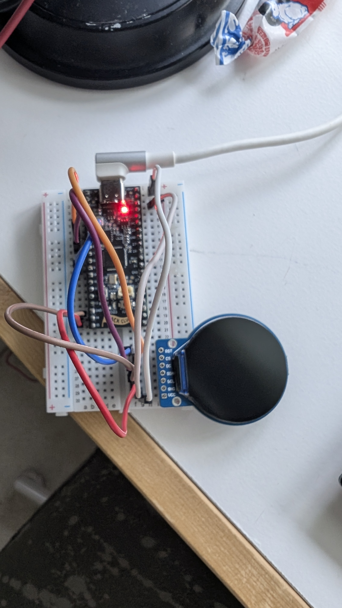
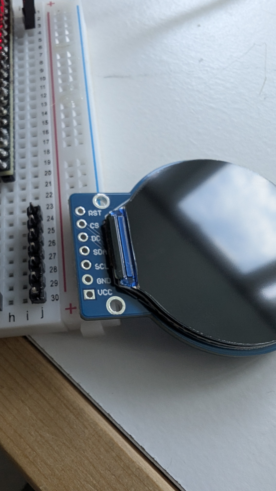
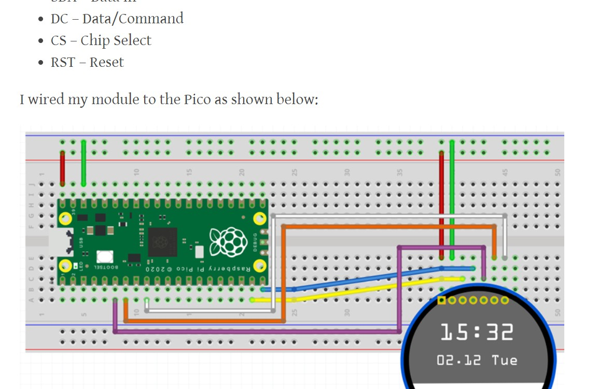
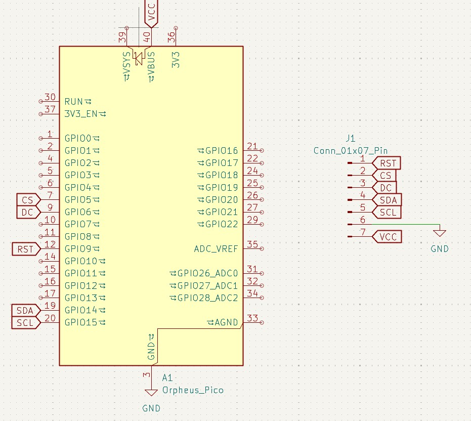
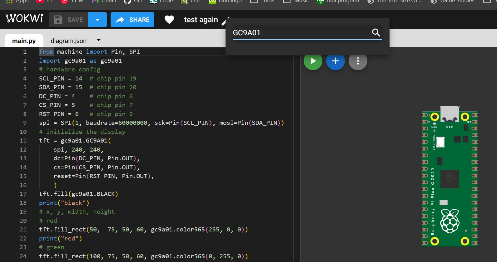
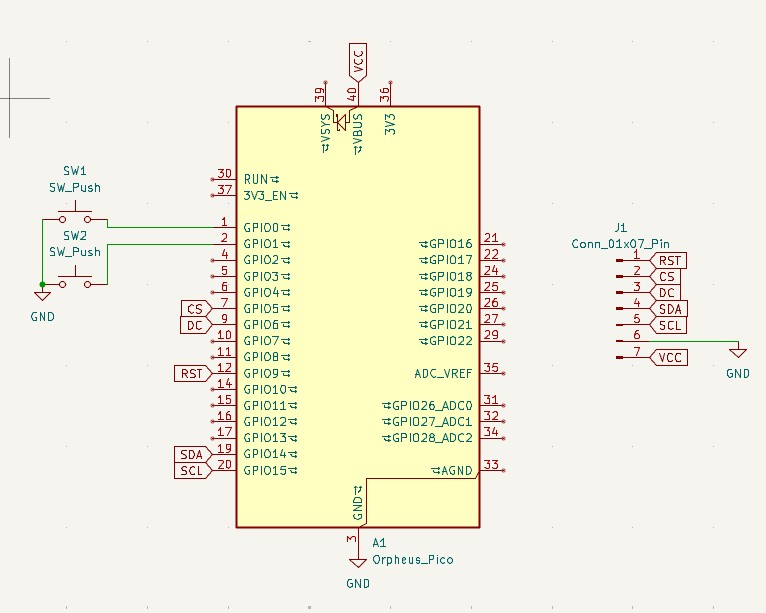
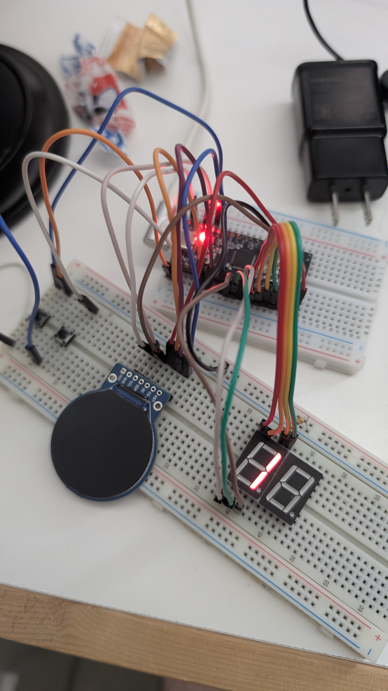

**FULL TIME ESTIMATE SO FAR: 9h15m (if I didn't forget how math works)**

# July 31st morning: Started the project, research

So I started working around 9am ish, and came up with an idea for a project: A simple flappy bird game on a round display I had laying around. This was quite out of my comfort zone, as I had never used this kind of display before, and although I've had it for some time, the first time I ever saw it in use was at undercity (I believe it was the same model but I may be wrong.) on the Minion robot. I went ahead and started researching how to even go about connect the display, and after some trial and error, I came upon [this article](https://cebess.wordpress.com/2024/04/19/raspberry-pico-and-gc9a01-round-display-in-micropython/) which shows how to use it in micropython. I was originally thinking about using circuitpython, but for now I have opted to follow the instructions and figure out the display. So far, I have the test code and I have wired everything up with my Orpheus pico. I haven't actually tested it yet, as I haven't soldered the display yet. Will do that now. Wish me luck!

Next steps:

- solder display
- schematic
- add buttons

**Total time spent: 2h50m**

# July 31st noon-ish: Working on schematic

My father informed me I shouldn't solder anything without supervision (:skull::skull::skull:) so I was stuck making a schematic on KiCad. I didn't make a PCB yet because I'm thinking about using a perfboard (hope that's allowed...). I haven't decided what pin I want the button(s?) on yet, so the schematic is literally the pico with a 1x7 connector atm. Feeling kind of hungry so I'm going to go eat lunch.

**Total time spent: like 25m :sob:**

# July 31st early afternoon: Wokwi

Ok lunch wasn't ready yet and it hit me that I could possibly try to test the code using Wokwi, but after about 15 minutes of trying to make it work I realised that there's no display component in wokwi and I gave up.

**Total time spent: 10m**

# July 31st after lunch: Pivoting and continuing schematic

So I decided that I would rather make something like the chrome dino or geometry game rather than flappy bird, but I don't want to change the repo name because I'm too lazy :skull:. (I wrote this previous section before starting the session)

I continued working on the schematic and added two pushbuttons and two seven-segment displays. I will use the pushbuttons to control the game (1 will probably be play/pause) and the displays to show the score. After finishing and organizing the schematic (hopefully the last revision? :crossed_fingers:), I tried to wire up the circuit on two breadboards but realised I don't have enough jumper wires for both displays, so I left one unwired. I also worked on a test file for the display, and i'll port it over later. My mom's been home for about an hour now, so I can go solder.

**Total tIMe spent: 2h20m**

# July 31st afternoon/evening: Soldering

I soldered the display pins. It went quite terribly wrong :sob:... First of all, I soldered the GND and VCC pins together (because i'm stupid), then when i finally separated them, it still didn't work, besides the backlight slightly brightening. I hope this is just because of my soldering, and I will buy another display later with the grant money.

[bad soldering video](./journal-assets/10-bad-soldering.mp4)

**Total time spent: 2h30m :sob:**

# July 31st evening: 3D Design

I designed the case, trying to leave as much space and clearance as possible. I then exported [f3d](./cad/f3d/) files and [step](./cad/step/) files, available in the respective folders. I actually used the [hackpad case design tutorial](https://hackpad.hackclub.com/guide#case) for this :skull:. I also updated the schematic to have resistors.

**Total time spent: 1h**

