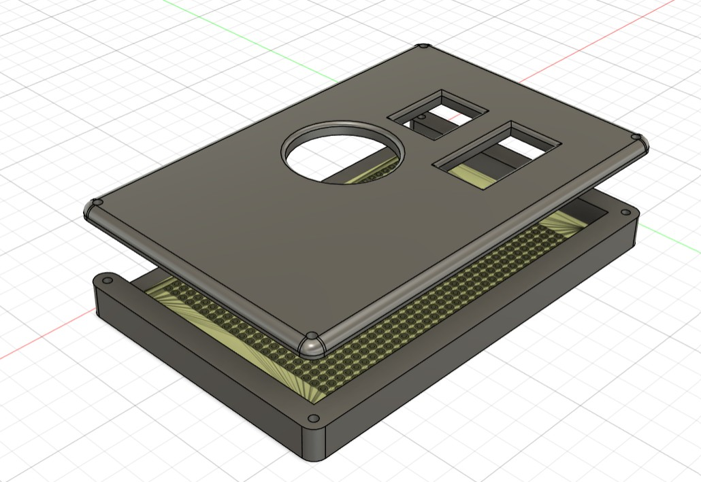
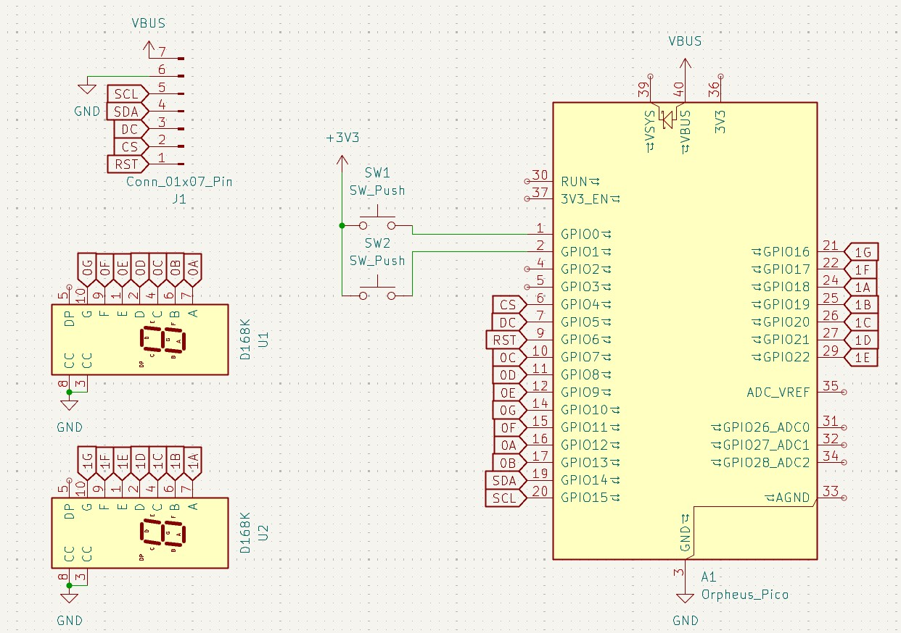

# floppy_square

A flappy bird-like game on a Round GC9A01 display made with an Orpheus Pico.

I made this project because I wanted to squeeze in one final highway project before the deadline, and I used components I had lying around. My idea was to make a nostalgic childhood game, Flappy Bird, although I have since decided to switch to a chrome dino kind of game. Not everything went to plan, like when I accidentally soldered the GND and VCC pins on my display, bricking it and being unable to test the project.

## Bill of Materials

| Part name | Quantity |
| --- | --- |
|Orph pico | 1 |
| 7 segment display | 2|
| Cherry MX switch | 2 |
| DSA Keycap | 2 |
| M3x16 Bolt | 4 |
| M3 Heatset Insert | 4 |
| Round GC9A01 display | 1 |
| Resistor - 400Ω | 2 |
| 1x20 Header socket 2pcs | 1 |
| 9x15cm single-sided Perfboard | 1 |
| 3D-Printed case | 1 |
